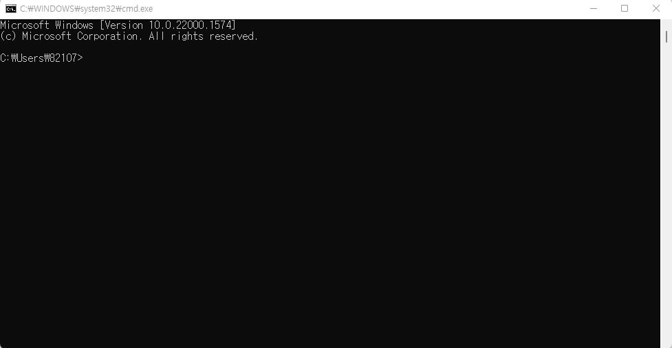

## 환영합니다

이 문서에서는 개발 환경 설치 방법과 가이드 활용 방법을 안내하고 있습니다.

### 1. 가이드 활용 방법

학습을 진행하면서 막히는 부분은 학회장에게 질문 혹은 구글 검색을 활용합니다.

### 2. GIS 도구별 비교

**CLI(Command Line Interface)**: 명령어를 입력하여 실행하는 방식. GUI보다 어렵지만 유연하며 속도가 빠르고, 재현 가능(reproducible)하여 다른 사람과 분석 방법을 공유할 수 있습니다.

* **R:** 통계를 위한 오픈소스 프로그래밍 언어. 2022년 기준으로 고려대 지리교육과 계량지리 수업에서 다룹니다.

* **Python:** 인터프리터 방식의 오픈소스 프로그래밍 언어. 주로 Pandas 모듈을 활용하여 통계 분석을 수행합니다. 2022년 GIScosm 학습 언어였습니다.

**GUI(Graphic User Interface)**: 마우스로 가리키고 클릭하는 방식. CLI보다 편리하고 쉬우나 느리고 무겁습니다.

- **ArcGIS Pro:** ESRI에서 개발한 전문가용 유료 GIS 데스크탑 어플리케이션. 2021년 GIScosm에서 이 Arc 계열 소프트웨어를 다루었습니다.

- **QGIS**: 오픈소스 GIS 데스크탑 어플리케이션. 2022년 기준으로 고려대 지리교육과 GIS개론 수업에서 다룹니다.

### 3. R/파이썬 설치 및 통합 개발 환경 구축

#### 3-1. R 설치하기


1. www.r-project.org 접속

2. CRAN->스크롤 쭉 내려서 Korea에 속한 두 링크 중 아무거나 클릭

3. 자신의 운영체제 선택

4. base선택

5. R설치파일 다운로드 후 실행

#### 3-2. 파이썬 설치하기


1. www.python.org 접속 후 Downloads 탭 클릭

2. All release 클릭

3. Download Python 3.~ 클릭. 설치파일 다운로드 후 실행.

4. **Add Python.exe to PATH 체크**

   5. 설치

#### 3-3. Jupyter Lab 설치하기

윈도우+R->'cmd'입력 후 엔터



```textile
python.exe -m pip install -upgrade pip    #pip 업데이트
pip install jupyterlab                    #주피터랩 설치
jupyter-lab                               #주피터랩 실행
```


주피터랩은 파이썬만 기본으로 지원하고 있습니다. 주피터랩에 R도 설치해 보겠습니다.

C:/Program Files/R/R-숫자가장높은거/bin/의 R.exe 실행하고

```r
install.packages("IRkernel")
IRkernel::installspec(name="r", displayname="R")
```


새로고침 하면 주피터랩에 R이 추가된 것을 볼 수 있습니다.


좌측 상단의 +버튼 혹은 좌측 파일 메뉴에서 우클릭->new Notebook->Select Kernel에서 'Python3 (ipykernal)'을 'R'로 바꾸어 R 코드파일을 만들 수 있습니다.


코드를 써넣고 컨트롤+엔터를 누르면 실행됩니다. 사진은 x변수에 100을 할당하고 출력한 모습입니다. 이처럼 코드가 작성되고 실행되는 공간을 코드블럭이라고 합니다.


코드블럭 오른쪽 끝에는 아이콘 버튼이 붙어있습니다. 각각 복사하기, 한 칸 위로 옮기기, 한 칸 아래로 옮기기, 위에 코드블럭 추가하기, 아래에 코드블럭 추가하기, 코드블럭 삭제하기 입니다.
