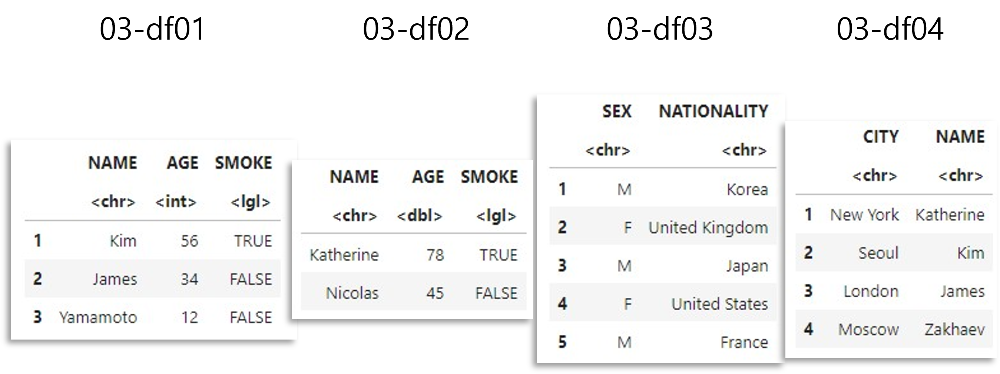
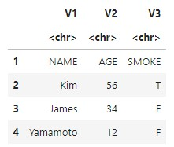
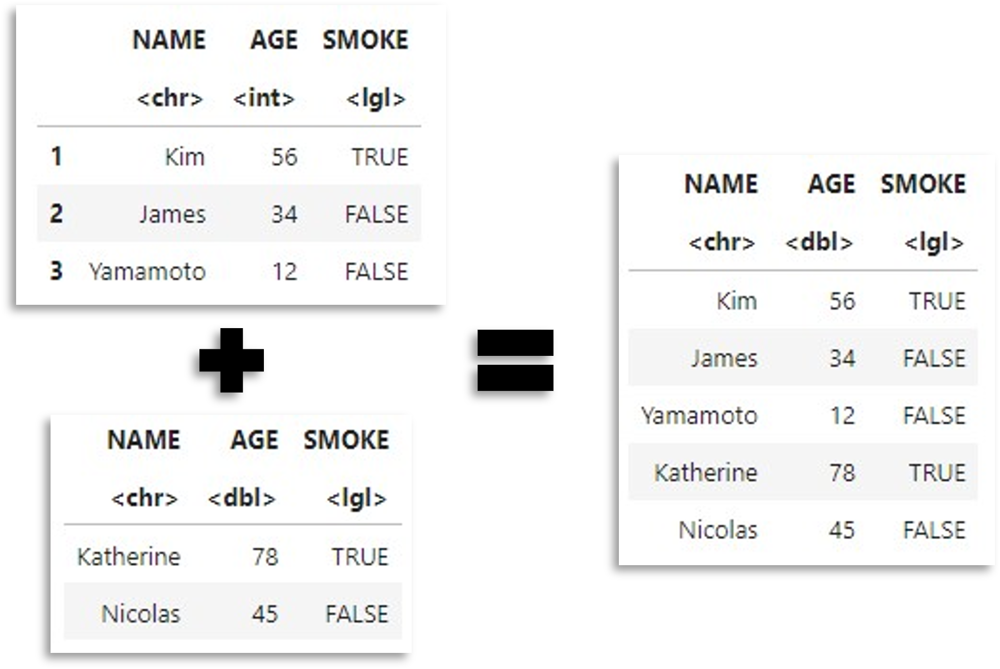
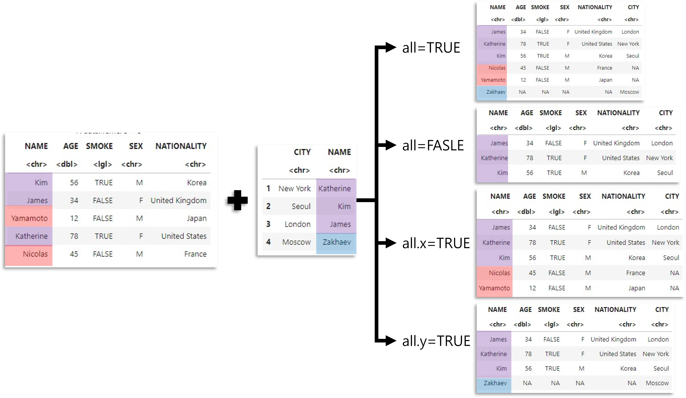

## 03. R 데이터프레임 다루기

-----

데이터프레임이란?: 길이가 같은 벡터들을 열 원소로 갖는 2차원 객체

이 가이드의 실습을 위해서는 dplyr, readxl, writexl패키지 설치 및 불러오기가 필요합니다.r

```r
install.packages('dplyr')
install.packages('readxl')
install.packages('writexl')
library(dplyr)
library(readxl)
library(writexl)실습에 사용할 파일: 02-df01.csv, 02-df02.xlsx, 02-df03.csv, 02-df04.csv
```

#### 03-1. 데이터프레임 불러오기

```r
df1<-read.csv("./데이터/03-df01.csv")        #csv파일 불러오기
df2<-read_excel("./데이터/03-df02.xlsx")     #xlsx파일 불러오
df3<-read.csv("./데이터/03-df03.csv")
df4<-read.csv("./데이터/03-df04.csv")
```



```r
df5<-read.csv("./데이터/03-df01.csv", header=FALSE) 
#첫 행을 변수명으로 불러오지 않음
```



-----

#### 03-2. 데이터프레임 결합

```r
df5<-rbind(df1, df2)    #세로로 쌓기(변수명이 동일해야 함)
```



```r
df6<-cbind(df5, df3)    #가로로 쌓기
```


```r
merge(df6, df4, all=TRUE)       #두 데이터프레임의 모든 행 유지
merge(df6, df4, all=FALSE)      #두 데이터프레임의 겹치는 행만 유지
merge(df6, df4, all.x=TRUE)     #왼쪽 데이터프레임의 행만 유지
merge(df6, df4, all.y=TRUE)     #오른쪽 데이터프레임의 행만 유지
```

