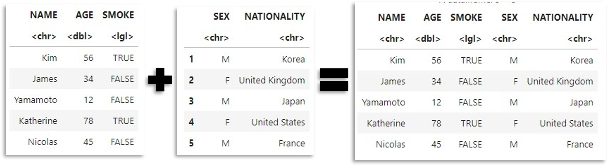
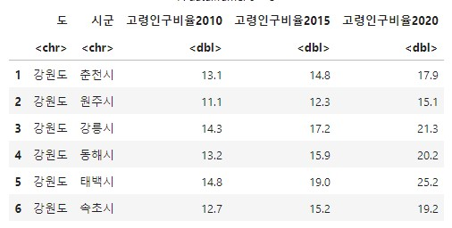
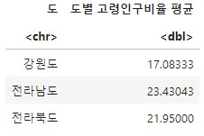

## 03. R 데이터프레임 다루기

-----

데이터프레임이란?: 길이가 같은 벡터들을 열 원소로 갖는 2차원 객체

이 가이드의 실습을 위해서는 dplyr, readxl, writexl패키지 설치 및 불러오기가 필요합니다.r

```r
install.packages('dplyr')
install.packages('readxl')
install.packages('writexl')
library(dplyr)
library(readxl)
library(writexl)실습에 사용할 파일: 02-df01.csv, 02-df02.xlsx, 02-df03.csv, 02-df04.csv
```

#### 03-1. 데이터프레임 불러오기

```r
df1<-read.csv("./데이터/03-df01.csv")        #csv파일 불러오기
df2<-read_excel("./데이터/03-df02.xlsx")     #xlsx파일 불러오
df3<-read.csv("./데이터/03-df03.csv")
df4<-read.csv("./데이터/03-df04.csv")
```


```r
df5<-read.csv("./데이터/03-df01.csv", header=FALSE) 
#첫 행을 변수명으로 불러오지 않음
```


-----

#### 03-2. 데이터프레임 결합

```r
df5<-rbind(df1, df2)    #세로로 쌓기(변수명이 동일해야 함)
```


```r
df6<-cbind(df5, df3)    #가로로 쌓기
```



```r
merge(df6, df4, all=TRUE)       #두 데이터프레임의 모든 행 유지
merge(df6, df4, all=FALSE)      #두 데이터프레임의 겹치는 행만 유지
merge(df6, df4, all.x=TRUE)     #왼쪽 데이터프레임의 행만 유지
merge(df6, df4, all.y=TRUE)     #오른쪽 데이터프레임의 행만 유지
```


-----

#### 03-3. 데이터프레임 연산

``` r
df10<-read.csv(".데이터/03-고령인구비율.csv", fileEncoding='euc-kr')
```

통계청에서 가져온 자료는 보통 문자 인코딩이 euc-kr로 되어 있기 때문에 읽어들일때 유의해 줍니다.



``` r
max(df10$고령인구비율2010)         #최대값
min(df10$고령인구비율2010)         #최소값
sum(df10$고령인구비율2010)         #합계
median(df10$고령인구비율2010)      #중위값
mean(df10$고령인구비율2010)        #평균
quantile(df10$고령인구비율2010)    #4분위수
summary(df10$고령인구비율2010)     #기술통계량 요약

filter(df10, df10$고령인구비율2010>20)     #특정 조건 만족하는 행만 선택
distinct(df10)                            #중복 행 삭제(잘 보면 신안군이 2개입니다.)
slice(df10, c(1,3,5,7))                   #행을 번호로 선택
slice_max(df10, df10$고령인구비율2010, prop=0.1)
                                  #특정 변수의 상위 몇%의 값을 가진 행 추출
pull(df10, 변수이름)                #특정 변수의 값들을 벡터로 추출
select(df10, 변수이름, 변수이름, 변수이름…)    #변수들을 선택
relocate(df10, 변수이름, .after=last_col())  #특정 변수를 맨 뒤로 보내기
rename(df10, “새로운이름” = “변수이름”)       #변수의 이름 변경
arrange(df10, desc(변수이름))       #특정 변수의 값에 따라 내림차순 정렬 
```

특정 변수에서 같은 값을 가진 행들끼리 묶어서 연산하려면 아래와 같이 하면 됩니다.

``` r
df10 %>% group_by(도) %>% summarise('도별 고령인구비율 평균' = mean(고령인구비율2010))
```
df10들의 행들을 '도'별로 묶은 뒤 '도별 고령인구비율 평균'이라는 이름으로 '고령인구비율2010'의 평균(mean)을 구했습니다.


