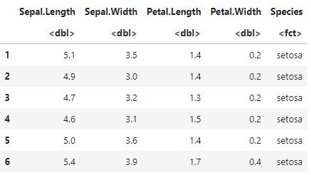
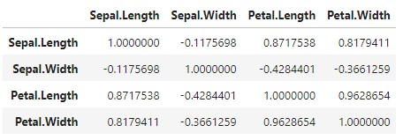

## 03.R 상관분석
상관분석(Correlation Analysis)이란?: 두 변수간의 선형적 관계를 상관계수를 통해 측정한 것입니다.

상관계수(Correlation Coefficient)란?: x와 y가 함께 변하는 정도. ±0.4~0.7이면 ‘다소 높다’ 라고 표현합니다.

Pearson: 상관분석에서 기본적으로 사용하는 상관계수. 연속형 변수의 상관관계 측정합니다.

Kendall’s tau: 변수값 대신 순위로 바꾸어 이용합니다. 샘플사이즈가 작거나 데이터의 동률이 많을 때 활용합니다.

Spearman’s rho: 변수값 대신 순위로 바꾸어 이용합니다. 편차와 에러에 민감한 편입니다.
상관분석으로는 두 변수 간의 인과관계를 알 수 없습니다.
```r
cor(df1, method=...)
#method에 pearson/kendall/spearman을 입력한다.
```

R에 포함된 자료를 활용하여 실제로 상관분석을 진행해 보겠습니다.

```r
data('iris')          //iris 통계데이터를 불러온다.
head(iris)            //iris의 첫 6행을 보여준다.
```



R에서는 통계 방법을 연습해 볼 수 있도록 여러가지 기본 통계데이터들을 제공하고 있습니다. ‘iris’는 1935년에 에드거 엔더슨 이라는 사람이 3개종 50송이의 붓꽃을 대상으로 꽃받침의 길이와 폭, 꽃잎의 길이와 폭을 기록한 통계데이터 입니다. 여기서 숫자가 아닌 species를 제외한 Sepal.Length 부터 Petal.Width까지의 4개 행을 상관분석해 보겠습니다.
```r
iris_cor<-cor(iris[ ,1:4], method="pearson")
iris_cor
```



iris에서 행은 전부, 열은 1번부터 4번까지 불러왔습니다. method는 가장 일반적인 pearson으로 하였습니다.

숫자로 나타낸 표는 한눈에 들어오지 않으니 그래프로 만들어서 확인하겠습니다. 상관분석 결과를 그래프로 만드는 방법은 크게 2가지가 있습니다.

corrplot 패키지와 PerformanceAnalytics 패키지를 설치해야 합니다.

```r
install.packages('corrplot')
install.packages('PerformanceAnalytics')
library(corrplot)
library(PerformanceAnalytics)
```

```
corrplot(iris_cor, method="circle", tl.srt=45, addCoef.col='white')
chart.Correlation(iris[,1:4], histogram=TRUE)
```


어떤 변수가 서로 높은 상관계수를 보이는지 확인해 봅시다.
