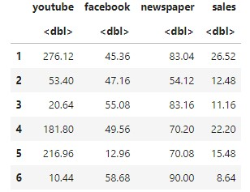
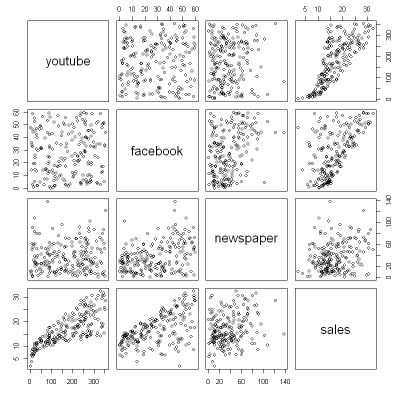
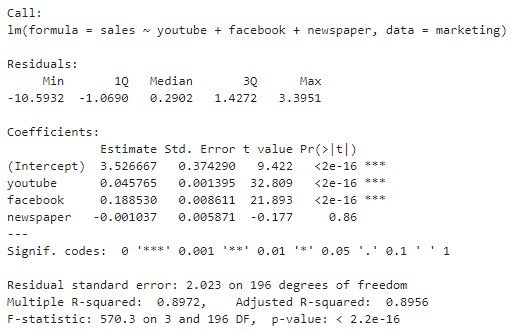
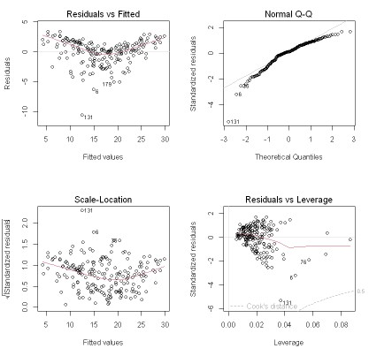
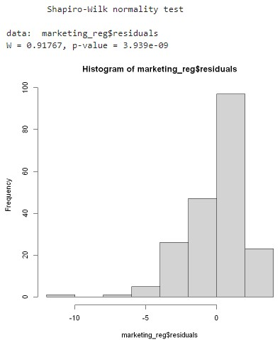
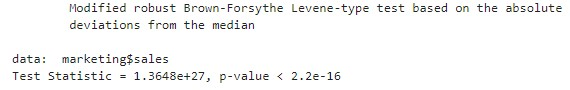

## 04.회귀분석
회귀분석(Regression Analysis)이란?: 한 개 또는 그 이상의 변수들(독립변수)에 대하여 다른 한 변수(종속변수) 사이의 관계를 수학적인 모형을 이용하여 설명하고 예측하는 분석기법입니다.

좀 많이 단순화하자면 각 오차항과의 거리(잔차)의 제곱이 최소가 되는 직선(yi)을 구하는 것이 단순선형회귀분석이라고 할 수 있습니다. 독립변수가 여러 개라면 다중선형 회귀분석/중선형회귀분석이라고 합니다. 여기에서 독립변수 x에 의해 설명되는 종속변수 y의 변동량은 결정계수(Coefficient of Determination) R2(R-square)로 나타낼 수 있습니다.

```r
model = lm(종속변수~독립변수, data=데이터프레임)     #잔차를 구하고
summary(model)                                    #기술통계량을 요약한다
```

Residuals(잔차): 잔차는 예측값과 실제값의 차이를 나타냅니다. summary 함수는 잔차의 최솟값(Min), 사분위수(1Q, Median, 3Q), 최댓값(Max)을 보여줍니다.

Coefficient(계수): 절편(Intercept)과 독립변수의 계수 추정치(Estimate)를 나타냅니다. 모든 독립변수가 0일때 종속변수의 값이 절편이고, 독립변수가 1 증가할 때 종속변수가 변화하는 양의 추정치가 Estimate입니다.

Pr(>|t|)는 모집단에서 계수가 0일 때, 현재와 같은 크기의 표본에서 이러한 계수가 추정될 확률인 p값을 나타냅니다. 

일반적으로 p값은 특정 값을 기준으로 유의미함을 나누는데, 잔차의 p값이 0.05 미만일 경우 통계 모델이 95% 신뢰구간에서 유의하다라고 하며, 가장 널리 사용되는 p값의 기준입니다. 잔차의 p값이 0.01미만일 경우 99% 신뢰구간에서 유의하다고 합니다.

Multiple R-squared/Adjusted R-squared: 종속변수의 분산을 독립변수(들)이 설명하는 정도.


F-statistic: 회귀모형에 대한 (통계적) 유의미성 검증 결과. 주로 0.05를 유의미함의 기준으로 합니다.

R-squared들은 낮은데 F-statistic의 값이 높다면?: 독립변수가 종속변수에 미치는 영향은 여전히 유의하지만, 회귀식에서 각 분산이 커서 예측에 대해서는 신뢰하기 어려움을 말합니다.

R(정확히는 datarium 패키지)에 포함된 자료를 활용하여 실제 회귀분석을 진행해 보겠습니다.
datarium 패키지 설치 및 로드가 필요합니다.

```r
install.packages('datarium')
library(datarium)
```

```r
data('marketing')
head(marketing)
```



datarium 패키지의 marketing 데이터는 유튜브, 페이스북, 신문 광고 투자금액과 매출액을 나타낸 데이터입니다. 우리는 각 광고 투자액과 매출액이 어떤 관계를 갖는지 다중선형회귀분석을 통해 알아보겠습니다. 우선 회귀분석에 앞서 각 데이터의 분포를 산점도를 통해 알아보겠습니다.

```r
pairs(marketing)
```



각 독립변수와 sales의 관계를 보면 newspaper의 경우에는 뚜렷한 선형 분포가 관찰되지 않는 것을 알 수 있습니다. 아마 유튜브, 페이스북, 신문 순서대로 의미있는 독립변수가 될 것이라고 예상할 수 있습니다.

```r
marketing_reg<-lm(sales ~ youtube+facebook+newspaper, data=marketing)
summary(marketing_reg)
```



예상대로 유튜브와 페이스북에 쓴 광고비용은 매출액과 관계가 있었습니다.
유튜브에 쓴 광고비용에 따라 매출액이 변한다는 가정과 페이스북에 쓴 광고비용에 따라 매출액이 변한다는 가정은 99.999% 신뢰수준에서 유의했습니다.

두 R-squared는 89%에 달하여 설명력이 높다고 할 수 있었습니다. F통계량의 p값 역시 모델이 99.999% 신뢰수준에서 유의하다고 말하고 있습니다. 다만 회귀분석에서는 잔차가 선형성, 정규성, 등분산성을 띈다는 가정을 기본적으로 하고 가기 때문에 이러한 가정이 지켜졌는지 그래프로 확인해 보겠습니다.

```r
par(mfrow = c(2,2))
plot(marketing_reg)
```



Fitted Values: 선형성 가설. 직선에 가까울수록 선형성을 띔

Normal Q-Q: 정규성 가설, 빨간 선에 가까운 직선일수록 정규성을 띔


Scale-Location: 등분산성 가설, 빨간 선에서 적게 벗어나 있을수록 등분산성을 띔

Leverage: 이상치, Cook’s Distance를 벗어난 점이 있다면 이상치가 결과를 왜곡하고 있다는 것을 의미합니다.

그래프 해석은 개인마다 주관적일 수 있기 때문에 수치로 정규성과 등분산성을 나타내 보겠습니다.
lawstat 패키지 설치 및 로드가 필요합니다.
```r
install.packages('lawstat')
library(lawstat)
```

```r
shapiro.test(marketing_reg$residuals)
#샤피로 정규성 검정

hist(marketing_reg$residuals)
```



```r
levene.test(marketing$sales, marketing$youtube+marketing$facebook+marketing$newspaper, location='median')
#레빈 등분산성 검정.location은 정규분포일 경우 mean, 한쪽에 치우치면 median, 양극단에 치우치면 trimmed mena를 사용한다.
```



샤피로 검정과 레빈 검정의 귀무가설은 ‘정규성/등분산을 만족한다’입니다. 따라서 p값이 0.05보다 커야 정규성/등분산성을 만족한다고 할 수 있는 것입니다.

두 검정 결과 모두 0.05보다 한참 작아 99.999% 신뢰구간에서 정규성, 등분산성을 만족하지 못한다고 할 수 있습니다.

그래프와 공식 확인 결과 선형성, 정규성, 등분산성 가정이 모두 의심스러운 상황입니다. 다만 사회과학 분야에서는 이러한 가정들을 모두 지키기가 매우 어렵기 때문에 어느정도 까지는 무시하는 경향이 있습니다. 다만 선형성, 정규성, 등분산성 가정이 어느정도까지 만족되는지는 제시할 필요가 있습니다.
